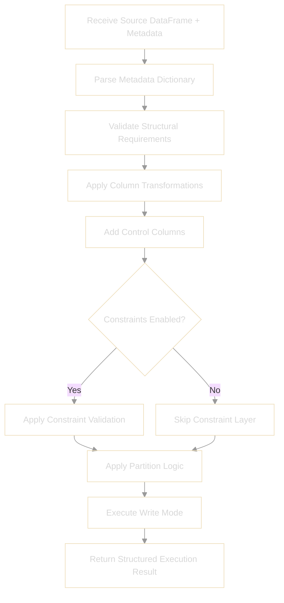

# Ingest Engine

The Ingest Engine is the execution core of the Ingestia framework.

It translates declarative metadata into deterministic, controlled, and reproducible data operations.

Ingestia is not a collection of notebooks — it is a metadata-driven execution engine.

---

## Design Principles

The Ingest Engine is built on the following principles:

- Metadata over hardcode  
- Deterministic execution  
- Idempotent by design  
- Explicit operational metadata  
- Clear separation between business and technical columns  
- Layer-aware processing  

---

## Conceptual Execution Flow

The engine follows a predictable and deterministic execution pipeline.

Each step is explicitly derived from metadata definitions.

---

## The `ingest()` Contract

The engine is executed through a single entry point:

`ingest()`

Conceptually, it receives:

- a source dataset  
- a metadata definition  
- execution configuration  
- optional runtime parameters  

The metadata determines:

- column structure  
- key definitions  
- partition strategy  
- write mode  
- constraint behavior  
- operational column handling  

The engine does not infer business logic.  
All structural decisions must be declared.

---

## Write Modes

Write behavior is explicitly declared in metadata.

### append  
Adds new records without removing existing data.

### overwrite  
Replaces target content based on declared strategy.

### merge (future-ready)  
Supports key-based upsert logic when primary keys are defined.

The engine never infers write behavior.

---

## Control and Operational Metadata

The engine manages operational traceability through reserved columns such as:

- `_batch_id`  
- `_ingestion_id`  
- `_ingestion_dt`  
- `_partition_<column_name>`  

These enable:

- idempotent execution  
- incremental strategies  
- traceability  
- deterministic reprocessing  

Operational columns are never considered business attributes.

---

## Idempotency

Ingestia is designed to avoid inconsistent states.

Idempotency is achieved through:

- deterministic batch identification  
- explicit write strategies  
- metadata-controlled partition logic  
- structured execution boundaries  

Reprocessing the same batch under the same metadata must produce the same result.

---

## Error Handling Philosophy

The engine does not silently ignore structural violations.

Execution results are structured and explicit:

- status  
- validation messages  
- execution metadata  
- processing metrics  

Failure is visible and traceable.

Future extensions may introduce severity levels such as:

- ERROR  
- WARN  
- QUARANTINE  
- SKIP  

---

## Layer Awareness

The engine respects logical layer boundaries:

- Raw layer → minimal structural enforcement  
- Transformation layer → standardization and structural rules  
- Serving layer → consumption-oriented datasets  

The engine enforces structure but does not dictate modeling methodology.

---

## Scope Boundaries

The Ingest Engine does not:

- enforce surrogate key usage  
- impose modeling frameworks (Kimball, Inmon, etc.)  
- manage semantic layer logic  
- dictate enterprise governance models  

It focuses strictly on deterministic ingestion and structural enforcement.