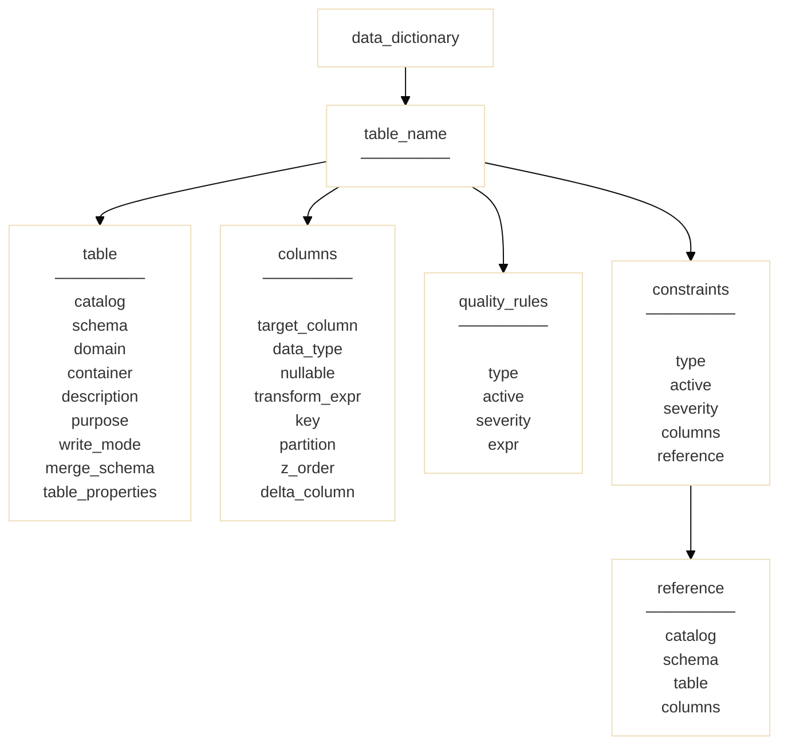

# Metadata Model Structure

Ingestia is a metadata-driven framework.

All execution behavior is derived from structured metadata definitions — not from hardcoded logic inside pipelines.

The Metadata Model defines how structure, constraints, and execution behavior are declared.

---

## Core Principle

> Data behavior must be declared, not inferred.

The Ingest Engine interprets metadata definitions and translates them into deterministic operations.

No structural decision is implicit.

---

## Metadata Architecture

Ingestia uses a simplified and explicit metadata structure:

- One metadata dictionary per table
- One optional integrity dictionary
- Partition strategy declared at column level

---

## Table Metadata Dictionary

Each table has its own metadata dictionary.

It defines:

- target layer
- domain
- object name
- column structure
- write behavior
- control column activation
- integrity reference (optional)

This dictionary is the single source of truth for table behavior.

---

## Column-Level Partition Strategy

Partitioning is declared directly within column definitions.

There is no separate partition dictionary.

If a column participates in partitioning:

- it is declared explicitly
- helper columns such as `_partition_<column_name>` may be generated
- derivation logic is deterministic

Partition behavior is structural, not inferred.

---

## Integrity Dictionary

The integrity dictionary is a separate structure referenced by the table metadata.

It may define:

- primary key rules
- unique combinations
- referential integrity
- structural validations

This separation ensures:

- structural metadata remains clean
- constraint logic remains reusable
- integrity rules can evolve independently

The integrity dictionary is optional but recommended for governed environments.

---

## Execution Relationship

| Responsibility | Table Metadata | Integrity Dictionary | Engine |
|---------------|----------------|----------------------|--------|
| Structure     | Yes            | No                   | Executes |
| Keys          | Yes            | May validate         | Executes |
| Constraints   | No             | Yes                  | Executes |
| Partitioning  | Yes (column-level) | No             | Executes |
| Write Mode    | Yes            | No                   | Executes |

The engine interprets both dictionaries during execution.

---

## Deterministic Design

Because metadata is explicit:

- execution is reproducible
- structural behavior is auditable
- engine logic remains stable
- changes are configuration-driven

The engine evolves independently from metadata definitions.

---

## Scope Boundaries

The Metadata Model does not:

- enforce a specific modeling methodology
- impose naming conventions beyond reserved patterns
- dictate enterprise governance models

It provides a declarative structural control plane for the Lakehouse.