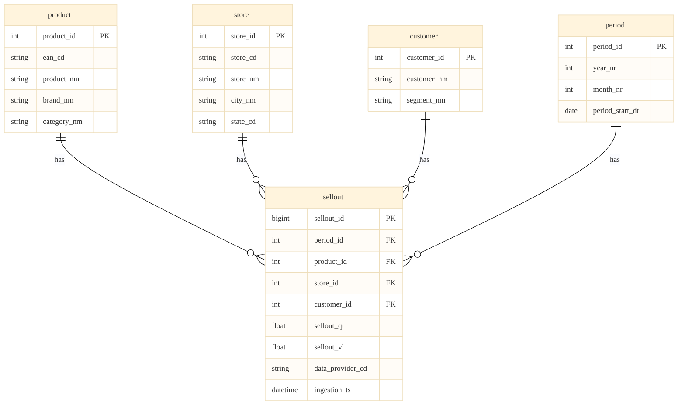

# Naming Conventions

Ingestia does not enforce a single naming convention for your entire data platform.  
However, a consistent naming strategy is required to ensure clarity, automation, and reliability.

The framework reserves only a small set of mandatory patterns required for its internal operation.  
Outside of those reserved patterns, organizations are free to adopt their own standards — as long as they remain consistent.

---

## Physical and Logical Naming

In Ingestia, physical and logical names are identical.

There is no abstraction or aliasing layer between catalog objects and pipeline references.  
The name defined in the catalog is the name used by the engine.

---

## Layer Structure

The conceptual responsibilities of each layer are described in *Layering Strategy*.  
Below is how naming may reflect that structure.

| Logical Layer        | Suggested Schema / Prefix Pattern |
|----------------------|------------------------------------|
| Raw                  | `raw_<domain>.<object>` |
| Transformation       | `transformation_<domain>.<object>` |
| └– Conformed         | `transformation_<domain>.<object>_conformed` |
| Serving              | `serving_<subject>.<object>` |

Ingestia does not enforce these exact prefixes, but consistency within the environment is required.

---

## Framework-Reserved Columns

Framework-controlled columns must begin with an underscore.

Typical examples:

`_batch_id`  
`_ingestion_id`  
`_ingestion_dt`  
`_source_file`  
`_partition_<column_name>`

Mandatory rules:

- lowercase only  
- snake_case  
- explicit and readable naming  

Columns starting with an underscore are considered operational or technical.  
Columns without underscore are considered business attributes.

---

## Partitioning Rules

When a technical partition column is required, it must follow this exact pattern:

`_partition_<column_name>`

Example:

`_partition_year_month`

Rules:

- snake_case  
- lowercase  
- written in full words  
- avoid ambiguous abbreviations (for example, avoid _partition_yyyymm)  

Partition columns are always considered operational metadata, not business attributes.

---

## Key Suffixes (Optional)

If your organization uses suffixes to differentiate key types, common patterns include:

`_cd` → natural key / business code  
`_id` → surrogate key / technical identifier  

These suffixes are not required by Ingestia.  
Other naming patterns may be used, provided they remain consistent across the environment.

---

## PK and FK Naming Consistency

A recommended best practice:

The name of the primary key (PK) in the dimension should be exactly the same as the foreign key (FK) in the fact table.

This improves readability, simplifies joins, and reduces ambiguity across the model.

*Ingestia strongly recommends this practice*, but does not enforce it.

### Example (PK = FK)

---

## Delta Table Naming Requirements

Tables and columns must comply with valid Delta Lake and Databricks naming rules.

In general:

- no spaces  
- avoid special characters (except underscore)  
- do not start names with numbers  
- avoid SQL reserved keywords  

For the official and most up-to-date rules regarding valid identifiers, refer to the Databricks SQL documentation:

Databricks SQL Language Manual – Object Names  
[https://learn.microsoft.com/azure/databricks/sql/language-manual/sql-ref-names](https://learn.microsoft.com/azure/databricks/sql/language-manual/sql-ref-names)

Ensuring compliance with these rules guarantees compatibility with Delta Lake operations, catalog management, and automated execution within Ingestia.

---

## Ingestia Naming Convention Template

!!! note "Section under development"
    A formal version of the *Ingestia Style* naming convention may be published in the future.