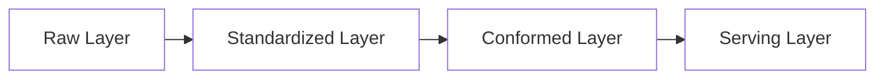
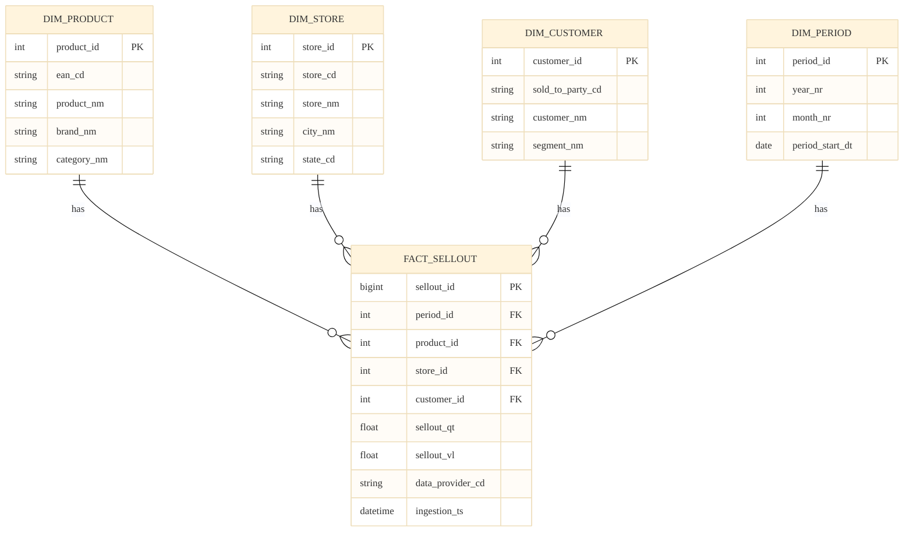

# Mermaid Examples

```mermaid
%%{init: {
  "flowchart": {
    "nodeSpacing": 20,
    "rankSpacing": 25
  }
}}%%
flowchart LR
  classDef card fill:transparent,stroke-width:1px;

  RAW[Raw Layer]:::card --> STD[Standardized Layer]:::card
  STD --> CNF[Conformed Layer]:::card
  CNF --> SRV[Serving Layer]:::card


```

```mermaid
%%{init: { "theme": "base", "themeVariables": {
  "fontFamily": "Inter, system-ui, -apple-system, Segoe UI, Roboto, Arial",
  "fontSize": "14px"
}}}%%

erDiagram
  DIM_PRODUCT {
    int product_id PK
    string ean_cd
    string product_nm
    string brand_nm
    string category_nm
  }

  DIM_STORE {
    int store_id PK
    string store_cd
    string store_nm
    string city_nm
    string state_cd
  }

  DIM_CUSTOMER {
    int customer_id PK
    string sold_to_party_cd
    string customer_nm
    string segment_nm
  }

  DIM_PERIOD {
    int period_id PK
    int year_nr
    int month_nr
    date period_start_dt
  }

  FACT_SELLOUT {
    bigint sellout_id PK
    int period_id FK
    int product_id FK
    int store_id FK
    int customer_id FK
    float sellout_qt
    float sellout_vl
    string data_provider_cd
    datetime ingestion_ts
  }

  DIM_PRODUCT  ||--o{ FACT_SELLOUT : has
  DIM_STORE    ||--o{ FACT_SELLOUT : has
  DIM_CUSTOMER ||--o{ FACT_SELLOUT : has
  DIM_PERIOD   ||--o{ FACT_SELLOUT : has

```